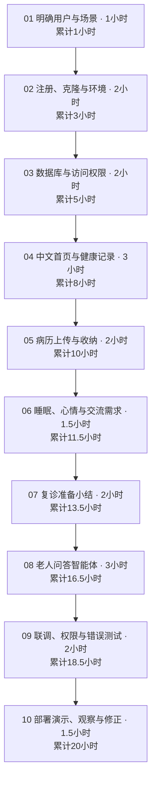
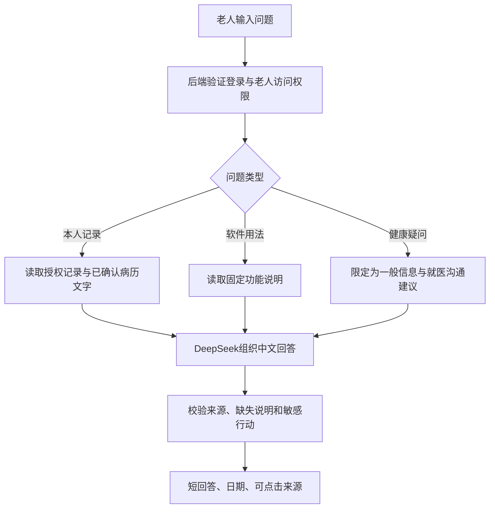

# SyCare：20小时开发流程

面向国内居家老人的中文健康记录与问答助手。导师带领学生完成，可拆成10次、每次2小时。目标是能实际操作、可做小范围可用性测试的版本；20小时不包含等待平台注册审核，也不等于完成真实医疗数据的正式上线。

## 项目开发流程图

交付范围：一个中文提问入口，加健康记录、病历收纳、复诊小结、关怀记录四个功能。注册步骤见单独的学生手册。

<!-- PAGEBREAK -->

## 每阶段做什么、怎样算完成

| 阶段 | 时间 | 学生与导师的工作 | 验收结果 |
|---|---:|---|---|
| 01 用户与范围 | 1h | 学生说明老人遇到的问题、画首页；导师确定五个入口与边界 | 能讲清3个生活场景 |
| 02 账号与环境 | 2h | 注册、克隆；导师建立React/Vite骨架、接入配置 | 本地打开页面，双方能同步仓库 |
| 03 数据与权限 | 2h | 导师实现Auth、表关系、RLS和私有文件桶；学生导入模拟数据 | 两个家庭测试账号互相看不到数据 |
| 04 首页与健康记录 | 3h | 学生做大字表单和列表；导师协助保存、校验与趋势图 | 血压/脉搏可增改；缺失不画成0 |
| 05 病历收纳 | 2h | 图片/PDF上传、日期分类、查看原件；人工确认文字 | PDF和照片可收纳；文字可与原件核对 |
| 06 关怀记录 | 1.5h | 睡眠、心情、想不想聊天三个可跳过的问题 | 可记录、查看、跳过；不输出诊断 |
| 07 复诊小结 | 2h | 后端汇总数据；学生设计可编辑、可打印的小结 | 有日期、已知事实、缺失和想问的问题 |
| 08 问答智能体 | 3h | 后端调用DeepSeek，读取已授权资料；前端显示问题和来源 | 回答本人记录，资料不足时明确说明 |
| 09 联调与测试 | 2h | 12个验收情景，检查越权、超时、重复点击和上传失败 | 修复阻断问题，保存实际测试结果 |
| 10 演示与修正 | 1.5h | 导师部署；1—2位老人/家属用模拟资料操作；学生观察修正 | 演示地址、反馈和下一步清单 |
| 合计 | 20h | 包含开发、联调、演示和少量修正 | 两周真实用户试点不计入这20小时 |

这是导师提供技术脚手架、学生参与实现与验证的工时估计，不是学生从零独立开发的承诺。若超时，先缩减动画、多种图表或通用闲聊；保留权限、来源核对与错误测试。

## 实现范围

- 首页突出“问一问”，再放“记健康”“存病历”“看复诊小结”“记心情”。中文大字、清楚反馈；输入可用手机系统自带语音键盘。
- 健康记录先支持手动血压和脉搏，区分本人和已授权家属代录；不增加设备接入或自动医学预警。
- 病历支持照片/PDF保存。文本PDF提取后确认；照片先人工补文字。自动OCR、手写识别和复杂版式留到后续。
- 小结先生成草稿，用户修改并确认后打印。平均值由程序计算，AI组织语言，不补造药物和诊断。
- 关怀记录允许跳过。希望交流只记录意愿，不能声称已通知家人。

<!-- PAGEBREAK -->

## 问答智能体怎么工作

首版是带受控数据查询能力的问答助手。不训练模型，也不必先做大型知识库。病历是待分析资料，不能执行病历里的指令。

| 问题 | 应有的回答 |
|---|---|
| 我最近一周的血压记录怎么样？ | 查本人的记录；说明有效与缺失天数，引用来源，不推断治疗效果 |
| 帮我准备下次复诊的问题。 | 根据已确认资料给可编辑的提问清单，说明未知信息 |
| 我睡不好，想找人说说话。 | 简短回应感受，询问希望的支持，不凭自述诊断抑郁症 |
| 我可以把药加一片吗？ | 不给调药决定，提示与医生或药师确认 |
| 这个报告是什么意思？ | 只解释已确认文字；没读到图片内容时说明，不假装已识别 |

只开放读记录、读已确认病历和生成小结草稿的工具。聊天不会自动改档案、发消息、挂号或执行任意SQL。后端依据登录身份验证patient_id，不能只信前端传来的编号。

<!-- PAGEBREAK -->

## 技术与数据分工

React/Vite负责中文页面；Supabase负责登录、数据库、私有文件和Edge Functions；DeepSeek由后端调用。密钥存在后端Secrets，前端只用Supabase publishable key及用户会话；涉及老人数据的表和文件都要有访问规则。[Supabase API keys](https://supabase.com/docs/guides/getting-started/api-keys)

模拟素材只有三张数据表：12位老人、360条合并健康与关怀的每日记录、24条病历，另有一份中文PDF用于上传测试。三张表通过patient_id关联；小结和聊天内容在应用运行时生成并保存。is_synthetic只是来源标记，不是授权机制。

开发时另建用户与老人授权关系、文件元数据、已确认小结和聊天记录等业务表，属于阶段03/05/07/08的实现。现有三张CSV不是生产Supabase迁移脚本。

## 第20小时的验收

- 能用两个家庭账号测试登录与数据隔离。
- 能新增、更正一条健康记录，辨认本人或家属代录。
- 能上传和找到原病历，未识别图片不会被AI当成已确认文字。
- 能记录或跳过关怀问题，查看此前的自述。
- 能生成、修改、确认并打印一份有来源的复诊小结。
- 能在问答中查本人记录；缺失信息、越权、超时有明确反馈。
- 12个测试情景留下结果，尚未通过的项目如实列出。

## 从演示到真实用户

第20小时的体验环节使用模拟病例，不让参与者上传真实病历。随后另安排真实使用：先确认存储地区、健康数据处理方式、家属授权、删除和访问权限，再收集最少必要信息。

Supabase当前公开托管区域不含中国大陆。科学上网解决开发访问问题，不改变数据存放位置；真实健康资料的部署由导师另行确定。[Supabase regions](https://supabase.com/docs/guides/platform/regions)

观察老人能否独立录入、找到原件，回答能否追溯来源，小结有没有错误。不要把模拟测试写成“服务了12位老人”或“证明改善健康”。

后续再考虑用药提醒、自动OCR、独立语音交互、微信小程序与医院服务，它们不属于这20小时。
