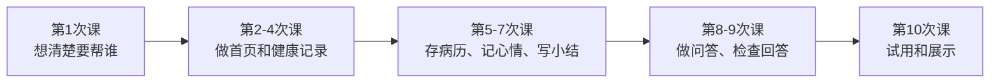

# SyCare：学生版20小时开发流程

我们要做一个给国内老人使用的中文小工具：老人可以在首页**问一问**，也可以**记健康、存病历、看复诊小结、记心情**。目标是在导师帮助下做出能操作、能用模拟资料演示的第一版，不是20小时内完成正式医疗产品。

课前先按[学生入门手册](02_学生注册与协作手册.md)注册账号、接受邀请并把仓库克隆到电脑。下面按**10次课，每次2小时**安排；平台注册和等待邀请不占课堂开发时间。

## 这20小时怎么走

| 课次 | 你主要做什么 | 导师主要帮什么 | 这次课结束时能看到什么 |
|---|---|---|---|
| 1 · 2小时 | 讲出老人会遇到的3个具体问题，画一张大字首页草图 | 帮你缩小范围，确定五个入口 | 一张能解释给老人听的页面草图 |
| 2 · 2小时 | 做中文首页，让“问一问”和四个功能容易找到 | 建立网页项目，接好登录与数据连接 | 登录后能打开首页，字和按钮看得清 |
| 3 · 2小时 | 做“记健康”：输入日期、血压和脉搏 | 建好存储表和访问权限，处理保存错误 | 能新增一条记录，再打开时还在 |
| 4 · 2小时 | 做健康记录列表和简单变化图，测试没填数据的情况 | 检查家属代录身份和数据是否串到别家 | 能回看记录；没填的读数不会显示成0 |
| 5 · 2小时 | 做“存病历”：上传PDF或照片、按日期找回原件 | 设置私有文件存储，处理上传失败 | 能上传并重新打开一份模拟病历 |
| 6 · 2小时 | 做“记心情”：睡眠、心情、想不想找人聊聊，都可跳过 | 保存记录，确保跳过不会被误解成“不好” | 能记录、跳过、回看；不自动通知家属 |
| 7 · 2小时 | 设计“复诊小结”：让老人能看懂、修改和打印 | 从已有记录整理事实，标出缺少的信息 | 生成一份可编辑的小结草稿 |
| 8 · 2小时 | 做“问一问”的输入框与回答页面 | 让DeepSeek只读取登录者有权看的资料 | 能用中文提问，并看到简短回答 |
| 9 · 2小时 | 用真实会问的问题检查答案、日期和资料来源 | 检查越权、答非所问、超时与错误提示 | 回答能指出依据；不知道时会说不知道 |
| 10 · 2小时 | 请1—2人用模拟资料试操作，记录卡住的地方并修改 | 帮忙部署演示版，修复最后的阻断问题 | 一个可演示的版本和一份操作反馈记录 |

合计**20小时**。导师负责较难的登录、权限、数据库和部署；你要亲手参与页面、文字、功能实现和测试，能解释每个功能为什么这样做。coding 工具可以帮助写代码，但不能代替你检查结果。若某一步比预计久，先减少装饰和额外图表，保留基本操作、隐私隔离与正确提示。

## 演示时用哪些资料

`data/` 里有12位**虚构**老人的档案、30天每日记录和病历文字；`data/测试数据/` 有3份上传测试PDF。三张CSV表用 `patient_id` 找到同一位老人。上课先看这三种例子：

| 编号 | 适合演示什么 |
|---|---|
| `SYN-001` | 录入和回看血压、脉搏 |
| `SYN-003` | 睡眠变少、希望交流，以及上传病历PDF |
| `SYN-006` | 本人不愿把记录自动分享给家人 |

这些都是编造的教学资料，不能写成“已经服务12位老人”。体验者也只用模拟资料，不上传真实病历。

## 怎么判断第一版做成了

- 老人能找到五个入口，用大字页面完成一次记录。
- 健康记录能保存和更正，能看出本人或家属代录；缺失读数不会被当成0。
- 病历原件能上传、找回；没有确认过的图片文字，不会被问答当成事实。
- 心情问题可以跳过；“想找人聊聊”只表示意愿，不假装已通知家人。
- 复诊小结能修改后打印，内容能找到来自哪条记录。
- 问答只查看本人获授权的资料。比如问“最近血压怎样”，应说明日期和已记录的天数；问“药能不能加一片”，不能替医生做决定。
- 用两个不同家庭的测试账号检查：彼此看不到对方资料；网络或上传失败时，页面会清楚提示。

导师需要守住几条技术底线：由服务器核对每个账号能看谁的资料；病历图片里的文字经人确认后才能供问答使用；问答不自动改记录或给家属发消息；DeepSeek 密钥只放在后端。

课上展示完成后，再决定是否让老人输入自己的健康资料。正式收集国内老人的健康资料前，导师要另行确认存储地区、本人及家属授权、删除方式和资料保护；这不包含在20小时的演示版里。
